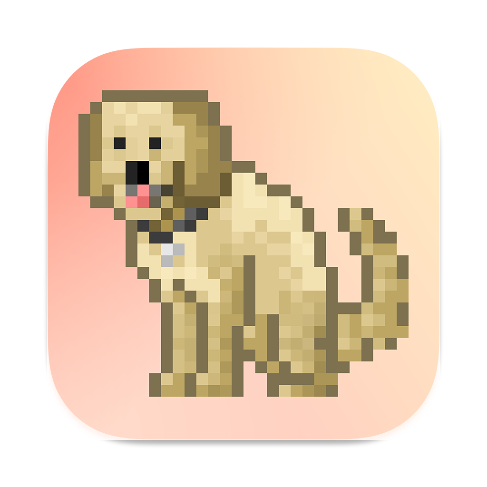

# Fetch-Remastered

<picture>
    
</picture>

### **Development Process & Technologies**

Fetch Remastered is styled in 8-bit graphics, and uses `swift` and `swiftUI` to create a dynamic and intractable, yet heavily stylized UI. This style involves many custom ViewModifiers, advanced structures, and automatic sizing systems, all written and executed in `SwiftUI`. The gameplay of the app relies on `SpriteKit` and `GameKit`.

The app also contains a widget customization system that allows users to build their own ‘squares of UI’ they can display on `iOS14+` homescreen. This process includes collecting user intentions from a SwiftUI form, translating them into binary data to store in UserDefaults, and reading them in / display them on the homescreen with `WidgetKit`.

There is also a robust data visualization system that processes and displays data collected from the gameplay in a user’s profile. All graphs, charts, and tables are dynamic and intractable. This system was built before swift 6 + iOS16 introduced the `SwiftCharts` package and was built manually on top of the swiftUI framework

### **Role & Responsibilities**

I independently developed this project, from project brainstorming, development, testing, release, and marketing. I also designed, drew, and edited all assets of the app—including app UI, sprites, animations and game map, as well as icons and marketing materials. This was done using a combination of photoshop, lightroom, and various other editing software. I used skills in system design, OOP, various Apple frameworks, and visual / product design to put together this project.

### **Product Description**

Fetch Remastered is an iOS game centered around exploring a virtual world by playing fetch with your dogs. The core loop of the game involves ‘throwing’ a ball though a virtual map for a dog to chase and collect in-game currency. That currency can then be used to purchase cosmetics for the ball, your dog, or in-game modifiers that help throw the ball farther or collect more gold on each throw. Collecting cosmetics and unlocking the map allows users to create custom widgets to put on their iOS homescreen, or send stickers to their friends via an iMessages extension. The app also features a dedicated macOS counterpart.

### **Product Images**

---

|                                                                     ---                                                                      |                                                                     ---                                                                      |                                                                     ---                                                                      |                                                                     ---                                                                      |                                                                     ---                                                                      |
| :------------------------------------------------------------------------------------------------------------------------------------------: | :------------------------------------------------------------------------------------------------------------------------------------------: | :------------------------------------------------------------------------------------------------------------------------------------------: | :------------------------------------------------------------------------------------------------------------------------------------------: | :------------------------------------------------------------------------------------------------------------------------------------------: |
|  |  |  |  |  |

---

|                                                                   ---                                                                    |                                                                   ---                                                                    |                                                                   ---                                                                    |                                                                   ---                                                                    |                                                                   ---                                                                    |
| :--------------------------------------------------------------------------------------------------------------------------------------: | :--------------------------------------------------------------------------------------------------------------------------------------: | :--------------------------------------------------------------------------------------------------------------------------------------: | :--------------------------------------------------------------------------------------------------------------------------------------: | :--------------------------------------------------------------------------------------------------------------------------------------: |
|  |  |  |  |  |

---

|                                                                     ---                                                                     |                                                                     ---                                                                      |                                                                     ---                                                                     |                                                                     ---                                                                      |
| :-----------------------------------------------------------------------------------------------------------------------------------------: | :------------------------------------------------------------------------------------------------------------------------------------------: | :-----------------------------------------------------------------------------------------------------------------------------------------: | :------------------------------------------------------------------------------------------------------------------------------------------: |
|  |  |  |  |

### **Product Description**

We all love dogs! Loyal companions, trust-worthy friends, and best buds! Unfortunately, there are times in our lives where we oh-so-tragically must be separated from them. Whether it be a strict landlord or a pesky allergy, there are some moments we just cannot play fetch with them. Luckily, in these times of despair, these days of woe, these moments of tragedy, there is hope: Fetch - Remastered! No longer do you require nice weather, a yard, and a functioning arm to play fetch, for that is a thing of the past! Now you can simply whip a ball into the stratosphere that will be endlessly chased down by a dog, fox or even a robot. No more are the feelings of blue! No more shall you wallow and wonder "if only”. No more do we conform to the basic laws of physics. Now, we play Fetch - Remastered! Enjoy!
